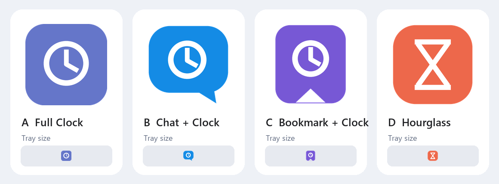

# DingLater 图标候选

- A `full-clock`：放大现有紫色时钟标识，贴满画布，16 px 下最饱满；当前默认采用。
- B `chat-clock`：强调“消息稍后处理”，语义最直接。
- C `bookmark-clock`：强调“收藏/稍后”，品牌感更强。
- D `hourglass`：强调“延后”，轮廓最简洁。

四套候选均包含可编辑 SVG、256 px PNG 和多尺寸 ICO，位于
`src/DingLater.App/Assets/IconCandidates/`。修改 `scripts/render-assets.py`
中的 `ACTIVE_VARIANT` 后重新运行脚本，即可同步应用图标和托盘图标。
